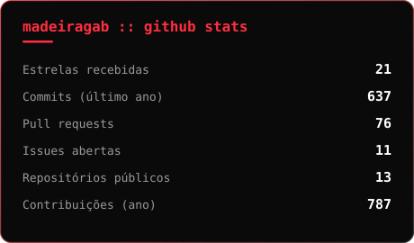
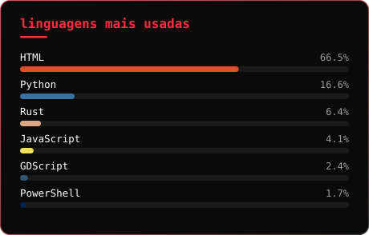

> 🇧🇷 **Português** · 🇬🇧 [English](README.en.md)

#  Hello World!

##  Sobre mim:

Me chamo **Gabriel Madeira**, sou estudante de **Ciência da Computação** no IFSulDeMinas e me especializo em **desenvolvimento backend**. Construo sistemas funcionais, MVPs e APIs bem modeladas — com a regra de negócio no servidor, documentada e testável.

- 🎓 **Formação:** Ciência da Computação — IFSulDeMinas *(cursando)*
- 💼 **Atualmente:** estagiário bolsista no Laboratório de Redes de Computadores (IFSulDeMinas — Campus Muzambinho), em um projeto de reformulação para recolocar o laboratório em funcionamento
- 🎯 **Objetivo:** Desenvolvimento Backend · APIs REST · Integrações
- 🧠 **Foco:** Modelagem de domínio, Django, PostgreSQL e documentação técnica
- 🔍 **Curiosidade:** já fiz jogo em Pygame, simulador de IA em Godot e engenharia reversa de console portátil
- 🤖 **No dia a dia:** uso IA como ferramenta de trabalho, sempre com revisão em cima
- 🌎 **Idiomas:** Inglês (Avançado) | Espanhol (Básico)

 

##  Tecnologias e Stack:

### ⚙️ Back-End &amp; Banco de Dados

### 💻 Front-End

### 🔧 Ferramentas de Desenvolvimento

 

##  Projetos em destaque:

| Projeto | O que é | Stack |
|---|---|---|
| **[Rastro](https://github.com/madeiragab/rastro)**  | Rastreamento e geocerca para rebanho bovino. Alerta quando o animal sai do pasto, fica parado tempo demais ou perde comunicação. 124 testes contra PostGIS real no CI, Argon2id com rotação de refresh token, simulador embutido — roda sem hardware nenhum. | `FastAPI` `PostGIS` `TypeScript` `Docker` |
| **[GEICIS Ponto](https://github.com/madeiragab/geicis-ponto)**  | Controle de horas de estágio: ranking, mínimo semanal e alerta por e-mail toda sexta. Domínio e contrato da API fechados em `docs/` antes da primeira linha de código. 58 testes no CI. | `Django` `DRF` `React` |
| **[Simulador Tático de IA](https://github.com/madeiragab/tcc-simulador-ia)** | TCC: ambiente para medir a qualidade estratégica de agentes de IA — não só se vencem, mas quanto processamento gastam. +14.000 partidas com teste de significância. | `Godot` `GDScript` `Python` |
| **[Social Network](https://github.com/madeiragab/social-network)** | API REST backend-first, com domínio modelado em UML antes do código e regras de negócio garantidas no próprio banco. | `Django` `DRF` `PostgreSQL` `React` |
| **[RPG Panel](https://github.com/madeiragab/rpg-panel)** | Painel web para campanhas de RPG de mesa, com controle de acesso por papéis e inventário por slots. | `Django` `Python` `JavaScript` |
| **[Guns and Boots](https://github.com/madeiragab/Guns-and-boots)** | Jogo 2D por turnos com mecânica de superaquecimento, IA por regras e lógica totalmente desacoplada da renderização. | `Python` `Pygame` |
| **[GA36-MB Autopsy](https://github.com/madeiragab/darkos-ga36-port)** | Engenharia reversa e preservação de um console portátil clone que mente sobre o próprio hardware. | `Linux` `Reverse Engineering` |

 

##  Minhas Redes:

 

##  GitHub Stats:

  

  

Os dois primeiros cards são gerados por [um script próprio](scripts/gerar-cards.mjs) e redesenhados todo dia por [GitHub Actions](.github/workflows/atualizar-cards.yml) — sem depender de serviço externo que sai do ar. O commit diário é assinado pelo `github-actions[bot]`, não por mim: o gráfico de contribuições aí em cima é só trabalho de verdade.

 

<!-- perfil -->
